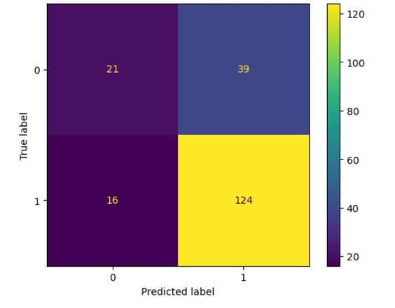
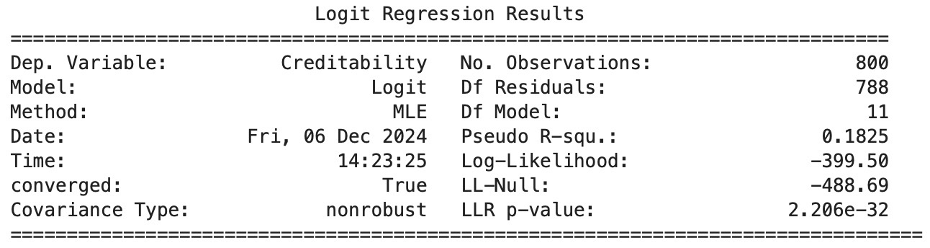

# German Credit Risk — Logistic Regression for Loan Approval

A logistic regression analysis applied to the **German Credit dataset** to support bank managers in making data-driven loan approval decisions, minimising both financial loss and business risk.

**Authors:** Filipa Neves,  Inês Rocha, Diana Fernandes  
**Institution:** Instituto Superior de Engenharia do Porto (ISEP)  
**Course:** Statistical Analysis of Data (ESADA)

---

## Problem Statement

When a bank receives a loan application, two types of risk arise:

- **Business loss:** rejecting a loan for a client who would have repaid it
- - **Financial loss:** approving a loan for a client who defaults
 
  - The goal is to build a predictive model that classifies loan applicants as **Good Credit** or **Bad Credit** based on their socioeconomic and demographic profile.
 
  - ## Dataset
  - - **Source:** German Credit dataset (UCI Machine Learning Repository)
    - - **File:** german_credit.csv
      - - **Observations:** 1,000 loan applicants
        - - **Variables:** 20 predictor variables + 1 binary target (`Creditability`)
          - - **Target:** 0 = Bad Credit, 1 = Good Credit (700 Good / 300 Bad)
           
            - Variables include account balance, loan duration, credit amount, payment history, loan purpose, employment status, age, marital status, housing type, and more.
           
            - ## Methodology
           
            - The project follows a structured data analysis pipeline:
           
            - **1. Data Understanding and Encoding** All numerical codes are mapped to descriptive labels for interpretability. No missing values were found in the dataset.
           
            - **2. Data Quality Assessment** Value counts are inspected for each categorical variable. Boxplots are used to identify outliers in numerical variables. No extreme anomalies were detected.
           
            - **3. Exploratory Data Analysis (EDA)**
            - - Bar charts for frequency distributions of categorical variables
              - - Stacked bar charts showing Good/Bad Credit proportion within each category
                - - Boxplots comparing numerical distributions between credit classes
                  - - Correlation heatmaps identifying multicollinearity between predictors
                   
                    - **4. Logistic Regression Modelling — Three Models**
                   
                    - | Model | Description | Variables |
                    - |-------|-------------|-----------|
                    - | Model 1 | Full model — all features | All 20 predictors (one-hot encoded) |
                    - | Model 2 | Reduced — significant variables only | 12 predictors (p < 0.05 from Model 1) |
                    - | Model 3 | Final — multicollinearity removed | 11 predictors (Instalment % removed) |
                   
                    - **5. Evaluation** Confusion matrix, accuracy, sensitivity, specificity, precision, recall, F1 score and AUC-ROC.
                   
                    - 
                   
                    - **6. Goodness of Fit** Hosmer-Lemeshow test to validate model calibration.
                   
                    - ## Results
                   
                    - **Selected model: Model 3**
                   
                    - | Metric | Value |
                    - |--------|-------|
                    - | Accuracy | 72.5% |
                    - | Sensitivity | 88.57% |
                    - | Specificity | 35.00% |
                    - | Precision | 76.07% |
                    - | F1 Score | 81.55% |
                    - | AUC-ROC | 0.618 |
                    - | Pseudo R² | 0.1825 |
                    - | Hosmer-Lemeshow p-value | > 0.05 (good fit) |
                   
                    - 
                   
                    - Model 3 was selected for its simplicity, interpretability and absence of multicollinearity, despite slightly lower explanatory power than Models 1 and 2.
                   
                    - **Key predictors of Good Credit:**
                    - - High account balance (>= 200 DM) — strongest positive predictor (OR ~4.27)
                      - - Good prior payment history
                        - - Used car loan purpose
                          - - Longer current employment
                           
                            - **Key predictors of Bad Credit:**
                            - - Longer loan duration
                              - - Foreign worker status
                                - - History of delayed payments or critical account
                                 
                                  - ## Requirements
                                  - ```
                                    pandas
                                    numpy
                                    matplotlib
                                    seaborn
                                    scikit-learn
                                    statsmodels
                                    scipy
                                    ```

                                    Install all dependencies:

                                    ```
                                    pip install pandas numpy matplotlib seaborn scikit-learn statsmodels scipy
                                    ```

                                    ## How to Run
                                    1. Clone this repository
                                    2. 2. Place `german_credit.csv` in the project root folder
                                       3. 3. Install the required dependencies
                                          4. 4. Open and run the notebook sequentially:
                                            
                                             5. ```
                                                jupyter notebook German_Credit_Risk_Analysis.ipynb
                                                ```

                                                ## Project Structure
                                                ```
                                                ├── German_Credit_Risk_Analysis.ipynb  # Main notebook
                                                ├── german_credit.csv                  # Dataset
                                                ├── confusion_matrix.png               # Confusion matrix visualization
                                                ├── logit_results_table.png            # Logit regression results table
                                                └── README.md                          # This file
                                                ```

                                                ## Authors

                                                **Filipa Sousa Neves**
                                                **Diana Fernandes**
                                                **Inês Rocha**

                                                Master's in Industrial Engineering and Management
                                                Instituto Superior de Engenharia do Porto (ISEP)
                                                [LinkedIn — Filipa Neves](https://www.linkedin.com/in/filipa-neves-15987a226)
